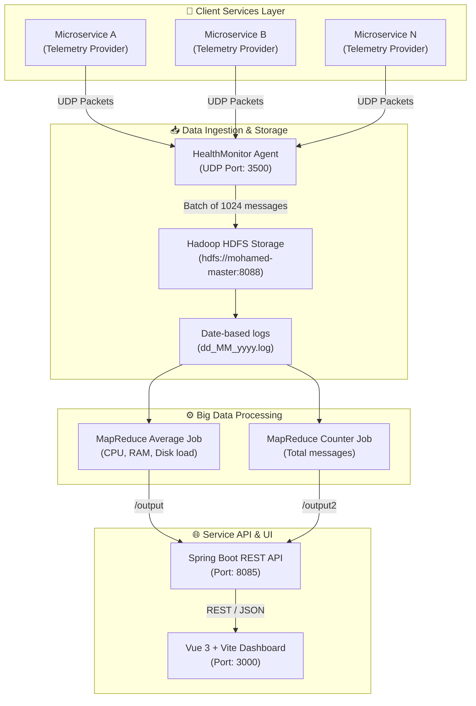

# 🏥 Health-Monitoring System

[](https://openjdk.org/)
[](https://spring.io/projects/spring-boot)
[](https://vuejs.org/)
[](https://vitejs.dev/)
[](https://hadoop.apache.org/)

A comprehensive Big Data telemetry ingestion, storage, and processing system designed to monitor distributed microservices. It features a lightweight UDP-based data collection agent, distributed storage via **Hadoop HDFS**, aggregation pipelines powered by **MapReduce**, a RESTful API built on **Spring Boot**, and a stunning, modernized **Vue 3 + Vite** dashboard with dynamic charts and dark glassmorphism aesthetics.

---

## 🖥️ Project Showcases

<table align="center" width="100%">
  <tr>
    <td width="50%" align="center">
      <b>📊 Operations Dashboard (Active Node View)</b>
      <br/><br/>
      
    </td>
    <td width="50%" align="center">
      <b>📈 Live Memory & Thread Analytics</b>
      <br/><br/>
      
    </td>
  </tr>
  <tr>
    <td width="50%" align="center">
      <b>🔍 Historical Performance & Heatmap</b>
      <br/><br/>
      
    </td>
    <td width="50%" align="center">
      <b>📋 Service Inventory & Status Dashboard</b>
      <br/><br/>
      
    </td>
  </tr>
</table>

---

## ✨ Key Features

*   **Real-time Ingestion**: Lightweight UDP agent collects CPU, RAM, and Disk utilization telemetry directly from active services.
*   **HDFS Batching Storage**: Accumulates performance metrics and writes them in batches of 1024 messages into daily logs in HDFS.
*   **Distributed Processing**: High-throughput MapReduce jobs (written using Hadoop APIs) to compute hourly averages and total metrics per service.
*   **Modern API Layer**: Layered Spring Boot microservice to expose aggregate analytics and manage queries across date ranges.
*   **Stunning Glassmorphism Dashboard**: Fully responsive dark-themed dashboard featuring:
    *   Radial CPU Gauge animations
    *   Historical resource trend charts (RAM/Disk)
    *   Activity feed for warning & critical threshold notifications
    *   Heatmap visualizing resource peak times per service

---

## 🏗️ Architecture & Data Flow



---

## 🛠️ Technology Stack

| Layer | Component | Version / Tech |
| :--- | :--- | :--- |
| **Frontend** | Vue 3, Vite, Pinia, Vue Router, Lucide Icons | Vue 3.x, Vite 5.x |
| **Backend** | Spring Boot, Web MVC, Actuator | Spring Boot 2.6.x / 3.x |
| **Storage** | HDFS (Hadoop Distributed File System) | Hadoop 3.3.1 |
| **Processing** | Hadoop MapReduce (Mappers/Reducers) | Java Hadoop API |
| **Ingestion** | DatagramSocket (UDP Telemetry Collector) | Java Net API |

---

## ⚙️ Directory Structure

```
Health-Monitoring_System/
├── src/main/java/              # Backend Java Codebase
│   ├── BackEnd/                # Spring Boot REST API Application
│   ├── Hadoop/                 # HDFS Writer & MapReduce Jobs
│   ├── HealthMonitor/          # UDP listener (Data Collector)
│   └── MicroServices/          # Client simulators & mock data
├── frontend/                   # Modernized Vue 3 + Vite UI
│   ├── src/                    # Views, Components, Stores, Composables
│   ├── vite.config.js          # Vite config
│   └── package.json            # NPM dependencies
├── Health Screens/             # Dashboard screenshots
├── pom.xml                     # Maven project configuration
└── README.md                   # This file
```

---

## 🚀 Getting Started

### Prerequisites

*   Java JDK 11 or 17
*   Maven 3.8+
*   Node.js 18+ & NPM
*   A running Hadoop/HDFS cluster (configured to `hdfs://mohamed-master:8088`)

### 1. Ingestion Agent & Simulator

Start the UDP collector that listens on port `3500` for metrics:
```bash
# Run HealthMonitor
java -cp target/classes HealthMonitor.HealthMonitor
```

Simulate active microservices sending health metrics:
```bash
# Run simulated microservices
java -cp target/classes MicroServices.Microservices <host_address> <port>
```

### 2. Big Data Analysis (MapReduce)

Run the Hadoop MapReduce jobs to parse raw telemetry logs stored in HDFS and compute statistical averages:
```bash
# Submit Count and Avg jobs to the cluster
java -cp target/classes Hadoop.Map_Reduce.Runner
```

### 3. Backend REST API

Compile and launch the Spring Boot application:
```bash
mvn clean install
mvn spring-boot:run
```
The backend API will start on `http://localhost:8085`.

### 4. Modernized UI Dashboard

Navigate to the frontend folder, install dependencies, and start the development server:
```bash
cd frontend
npm install
npm run dev
```
Open [http://localhost:3000](http://localhost:3000) in your browser to view the glassmorphism operations dashboard.

> [!NOTE]
> The Pinia store is equipped with auto-fallback to mock data, allowing you to test the dashboard UI without a running Hadoop cluster configuration.

---

## 🤝 Contributing

Contributions, issues, and feature requests are welcome! Feel free to check the [issues page](https://github.com/yourusername/health-monitoring-system/issues).

## 📄 License

This project is licensed under the MIT License - see the LICENSE file for details.
